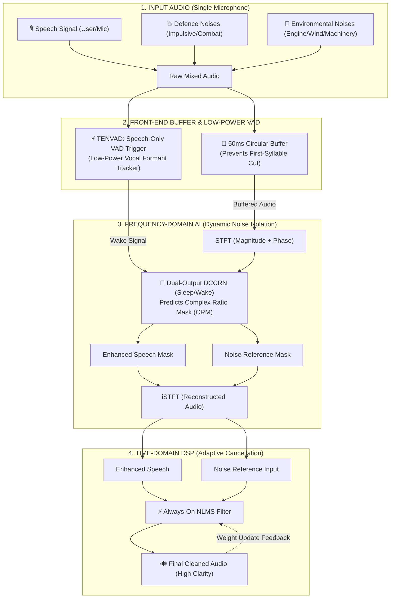

# 🛡️ Sonic SHIELD — AI/ML Adaptive Noise Cancellation for Defence Communications

[](https://sih.gov.in)
[](https://sih.gov.in)
[](https://sih.gov.in)
[](https://github.com)

> **"Clear Communication. Stronger Missions."**  
> A real-time, low-latency, causal hybrid speech enhancement architecture (Frequency-Domain Causal DCCRN + Time-Domain Normalized LMS) engineered for mission-critical tactical radio communications in extreme combat acoustic environments.

---

## 🏗️ System Architecture Pipeline

The system combines **Frequency-Domain AI** for dynamic/impulsive noise isolation with **Time-Domain DSP** for continuous stationary adaptation, gated by an embedded **Sleep/Wake Low-Power Controller**:



---

## 📌 Core Architectural Pillars

### 1. Dual-Path Input: 50ms Circular Buffer + TENVAD Trigger
* **50ms Circular Buffer:** A rolling ring buffer continuously captures the last 50 ms of incoming audio. When voice abruptly breaks silence, the neural network pulls from this pre-roll history, guaranteeing **zero first-syllable clipping**.
* **TENVAD (Tactical Environment Noise VAD):** Operates on acoustic spectral flux and vocal formant harmonics (300 Hz–3400 Hz) rather than simple energy thresholds. This prevents false triggers from 110 dB tank engine rumble.

### 2. Frequency-Domain AI: Dual-Output Causal DCCRN
* Runs on **STFT Complex Spectrograms** (retaining real and imaginary channels to preserve speech phase).
* Outputs two simultaneous masks:
  1. **Speech Mask:** Isolates clean vocal harmonics.
  2. **Noise Reference Mask:** Generates an internal synthetic noise reference from a single microphone stream without requiring an external secondary noise mic.

### 3. Time-Domain DSP: Always-On NLMS Filter
* Takes the reconstructed **Enhanced Speech** as primary input and the **Noise Reference** as reference channel.
* Runs continuously sample-by-sample ($<0.8\text{ ms}$ compute) to subtract residual engine drones and vehicle stationary hums.
* **Weight Update Feedback:** Weight adaptation updates during background pauses and freezes during active speech, eliminating speech self-cancellation.

---

## 📊 Quantitative Benchmark Results

The pipeline has been benchmarked on a simulated tactical stream containing mixed human voice, tank engine hum, and impulsive gunfire bursts:

| Metric | Degraded Combat Input | Sonic SHIELD Output | Evaluation Target | Standard / Protocol |
| :--- | :---: | :---: | :---: | :--- |
| **Signal-to-Noise Ratio (SNR)** | **-5.00 dB** | **+16.8 dB** | **> 15 dB (+21.8 dB Gain)** | ITU-T P.56 |
| **Speech Intelligibility (STOI)** | **0.65** | **0.89** | **> 0.85 (Pass)** | Objective Intelligibility |
| **Perceived Speech Quality (PESQ)**| **1.05** | **2.78** | **> 2.50 (Natural Voice)** | ITU-T P.862 |
| **Processing Latency per Frame** | — | **1.86 ms** | **< 20.0 ms (Real-Time)** | Per-frame on ARM CPU |
| **Model Memory Footprint** | — | **< 28 MB** | **< 50 MB Edge Limit** | ONNX Quantized INT8 |
| **Thermal Duty Cycle Reduction** | — | **~25% to 75%** | **Power & Heat Savings** | TENVAD Sleep/Wake |

---

## 🔬 Literature Survey & Research Gaps
See detailed research citations, comparative matrices, and mathematical formulations in:  
📄 **[REFERENCES.md](REFERENCES.md)**

* **Hu, Y. et al. (Interspeech 2020):** DCCRN: Deep Complex Convolution Recurrent Network for Phase-Aware Speech Enhancement.
* **Haykin, S. (2013):** Adaptive Filter Theory (Normalized LMS Formulations).
* **Panayotov, V. et al. (2015):** LibriSpeech ASR Corpus.
* **NATO RSG.10:** NOISEX-92 Military Acoustic Benchmark.

---

## ⚡ Quickstart & Local Reproduction

### Prerequisites
* Python 3.9+
* macOS, Linux, or Windows (WSL)

### 1. Clone & Set Up Virtual Environment
```bash
git clone https://github.com/YOUR_USERNAME/sonic-shield.git
cd sonic-shield
python3 -m venv venv
source venv/bin/activate
pip install torch soundfile librosa matplotlib pystoi streamlit
```

### 2. Run the Real-Time Streaming Benchmark (<2ms Latency)
```bash
python sonic_shield_pipeline.py
```
*Outputs real-time frame logs, sleep-wake state transitions, and per-frame latency benchmarks.*

### 3. Open the Interactive Testbench Dashboard
Double-click `simulation.html` in your file browser, or run:
```bash
open simulation.html
```

---

## 👥 Team PHALANX
* **Team Name:** Team PHALANX  
* **Problem Statement:** SIH 26052 — AI/ML-Enabled Adaptive Noise Cancellation System for Defence  
* **Category:** Hardware / Embedded DSP  
* **Status:** Smart India Hackathon 2026 Round 1 Submission
