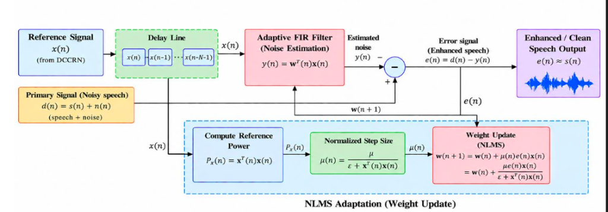

# Normalized Least Mean Squares (NLMS) Adaptive Filter: Mathematical Foundation & Architecture

### Project: Sonic SHIELD — Hybrid AI-Driven Real-Time Speech Enhancement for Defence Communications
### Team: Team PHALANX | Problem Statement: SIH 26052

---

## 1. System Overview & Signal Definitions

The Normalized Least Mean Squares (NLMS) filter operates in the **Time-Domain DSP** stage of the Sonic SHIELD pipeline. It acts as an adaptive post-filter downstream of the Frequency-Domain Dual-Output DCCRN to subtract stationary and slowly varying residual acoustic interference (tank engine rumble, diesel generators, constant cabin hum).

  

### Signal Representations:
1. **Primary Signal $d(n)$:**
   $$d(n) = s(n) + n(n)$$
   * $s(n)$: Desired clean speech component.
   * $n(n)$: Residual stationary defence noise remaining after DCCRN processing.
2. **Reference Signal $x(n)$:**
   * Synthesized noise reference generated by the DCCRN's secondary noise-mask head.
   * Correlated with the interference $n(n)$ in the primary path.

---

## 2. Mathematical Formulations

### 2.1 Tapped Delay Line Vector
An FIR filter of length $N$ requires a buffer of the current and past $N-1$ samples of the reference noise:
$$\mathbf{x}(n) = [x(n), x(n-1), x(n-2), \dots, x(n-N+1)]^T \in \mathbb{R}^N$$

### 2.2 Adaptive FIR Filter (Noise Estimation)
The filter coefficients at time index $n$ are represented by the weight vector:
$$\mathbf{w}(n) = [w_0(n), w_1(n), w_2(n), \dots, w_{N-1}(n)]^T \in \mathbb{R}^N$$
The estimated noise output $y(n)$ is computed via the inner product:
$$y(n) = \mathbf{w}^T(n) \mathbf{x}(n) = \sum_{i=0}^{N-1} w_i(n) \cdot x(n-i)$$

### 2.3 Error Signal Computation (Acoustic Subtraction)
The estimated noise $y(n)$ is subtracted from the primary signal $d(n)$:
$$e(n) = d(n) - y(n) = [s(n) + n(n)] - y(n)$$
When the adaptive filter converges such that $y(n) \approx n(n)$:
$$e(n) \approx s(n)$$
The error signal $e(n)$ becomes the final enhanced, clean tactical speech output.

---

## 3. NLMS Adaptation & Normalization Path

### 3.1 Instantaneous Reference Power Calculation
To prevent the filter weights from diverging during sudden high-amplitude acoustic surges (or stagnating during low amplitudes), the signal power $P_x(n)$ is calculated:
$$P_x(n) = \|\mathbf{x}(n)\|^2 = \mathbf{x}^T(n) \mathbf{x}(n) = \sum_{i=0}^{N-1} x^2(n-i)$$

### 3.2 Normalized Time-Varying Step Size
Standard LMS uses a fixed step size $\mu$, which becomes unstable when input power fluctuates. NLMS normalizes the step size inversely proportional to the instantaneous reference power:
$$\mu(n) = \frac{\mu}{\epsilon + \mathbf{x}^T(n) \mathbf{x}(n)} = \frac{\mu}{\epsilon + P_x(n)}$$
Where:
* $\mu$: Base step size adaptation parameter ($0 < \mu < 2$, typically $\mu = 0.08$ in our pipeline).
* $\epsilon$: Regularization parameter ($\epsilon = 10^{-4}$) to prevent division by zero during silence.

### 3.3 Weight Vector Update Rule
Combining the current weights $\mathbf{w}(n)$, the normalized step size $\mu(n)$, the error $e(n)$, and the reference vector $\mathbf{x}(n)$:
$$\mathbf{w}(n+1) = \mathbf{w}(n) + \mu(n) \cdot e(n) \cdot \mathbf{x}(n)$$
Substituting $\mu(n)$:
$$\mathbf{w}(n+1) = \mathbf{w}(n) + \frac{\mu}{\epsilon + \mathbf{x}^T(n) \mathbf{x}(n)} \cdot e(n) \cdot \mathbf{x}(n)$$

---

## 4. Voice-Activity-Gated Stability (Speech Protection)
In single-microphone setups, if speech leaks into the reference channel $x(n)$, standard adaptive filters adapt to speech and cancel the user's own voice (speech self-cancellation).

Sonic SHIELD prevents this by coupling the weight update to the **TENVAD** state:
* **During Speech Pauses (VAD = 0):** $\mathbf{w}(n)$ adapts actively on pure stationary noise.
* **During Active Speech (VAD = 1):** $\mathbf{w}(n)$ adaptation is **frozen** ($\mu = 0$):
  $$\mathbf{w}(n+1) = \mathbf{w}(n)$$
  The filter continues filtering out the learned stationary profile without adapting to speech formants.
